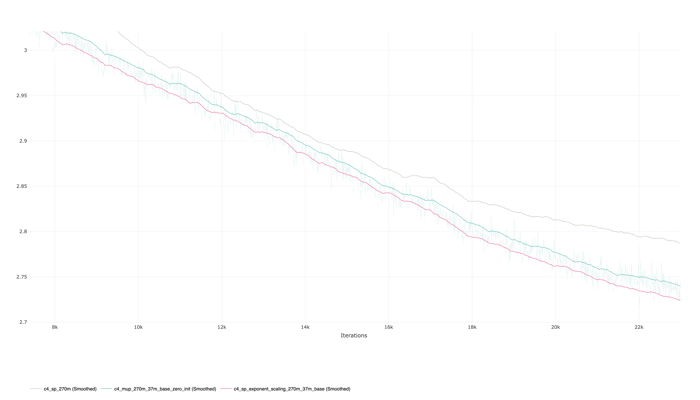
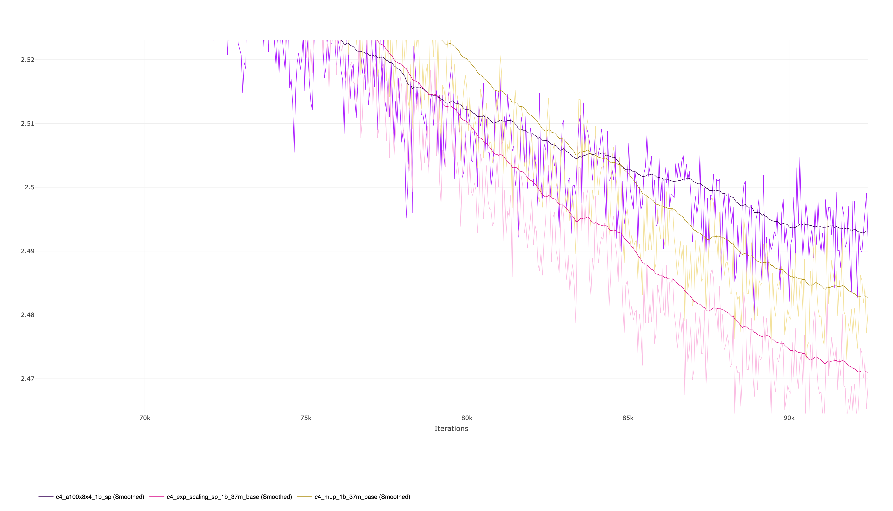

# Benchmarking Learning Rate Transfer

Recently, [Everett et al.](https://arxiv.org/pdf/2407.05872v2)  found that applying per layer learning rate prescription can enable hyperparameter transfer for other parameterization strategies besides muP and actually found that applying it to standard parameterization (SP) outperforms muP. I am attempting to reproduce their findings and determining the limits of its extensibility.

## Experiments

To verify the findings I performed parameter scaling from 13m and 37m base up to 1b models and compared them to two baselines - a model trained using SP without parameter scaling and the other being a muP model.

### Setup

For reference I used the following settings for my base models:

- [13m base fully aligned exponent scaling](https://github.com/clankur/muGPT/blob/526bc268907b0aadc86bef5aea8ff65df562f20b/configs/c4_a100x8x4_13m.yaml)
- [37m base fully aligned exponent scaling](https://github.com/clankur/muGPT/blob/526bc268907b0aadc86bef5aea8ff65df562f20b/configs/c4_a100x8x4_37m.yaml)

and applied parameter transfer to [270m](https://github.com/clankur/muGPT/blob/526bc268907b0aadc86bef5aea8ff65df562f20b/configs/c4_a100x8x4_270m.yaml) and [1b](https://github.com/clankur/muGPT/blob/526bc268907b0aadc86bef5aea8ff65df562f20b/configs/c4_a100x8x4_1b.yaml) models. Note these are using their own tuned gammas from an hyperparameter optimization instead of using their default values of 1 and are applying zero initialization for the queries and unembeddings - as muP found that this adjustment enables performance gains and I've noted this as something that can be applied to even SP models.

### Findings

[270m SP with tuned LR vs 270m muP transfer with 37m base vs 270m parameter transfer using SP with 37m base and fully aligned exponents](https://app.clear.ml/projects/c6c821d0a24e402eb4879dbe3ce93e2b/compare-experiments;ids=df7e20341b944c7685fcc054975aa21c,b85c64948d2747799e141fe99d41efa8,1151de73c92c49baaa612fd2a1567ed8/scalars/graph)

For 270m, appling parameter scaling with fully aligned exponent consistently was performing better than the other implementation of the 270m model, significantly outperforming the baseline SP implemented without parameter scaling, and achieving a slightly lower loss than the muP implementation.

[1b SP with tuned LR vs 1b muP transfer with 37m base vs 1b parameter transfer using SP with 37m base and fully aligned exponents](https://app.clear.ml/projects/*/compare-experiments;ids=b9044d8fd148453ab592d8839615f78f,95b1306d3bf243a4a601d41f2fd40760,8ba8cdbca4094bab8a458e9416fc97be/scalars/graph)

On the otherhand, with 1B we see both parameter scaling approaches only start outperforming the baseline SP in the last 10k steps - indicating this stage of training enables the parameter scaling models to learn critical features that improve its loss. We still observe that fully aligned exponent scaling outperform the baselines, substantiating the findings by Everett et al.

**Note** to view interactive plots of their loss from ClearML you will *need* to create an account with ClearML.

## Pending questions

### Alternative parameterization approaches

While I've only implemented exponent scaling for SP and muP, future work would include implementing NTK and benchmarking its parameterizations' performance, as Everett et al. found that it was the best model when applying per-layer unaligned exponents.

### Alignment

The paper observes that models with unaligned exponents achieve a lower loss, but also come with a caveat: the exponents do not appear to capture the learning rate scaling behavior as well as the fully-aligned exponents since the power law exponents are not close to zero. Everett et al. note that while exponent alignment choices may vary by use case, they conclude that unaligned exponents are generally preferable. They support this by stating that they found fully-aligned exponents have higher learning rate sensitivity, poor constant multiplier transfer, and a performance gap between unaligned exponents that only grows with scale.

As a part of a next round of experiments, I would want to get a better understanding the influence of alignment. So far I have only performed parameter scaling with fully aligned exponents, but in future runs I would run experiments to either verify the performance gains observed in the paper or verify their note that the type alignments may matter per use case and narrow down patterns of what they might be.

### Limits to parameter scaling

For both muP and exponent scaling, I observed their were some performance degradation depending on the selected base model, as a 13m base model with head dimension of 32 **[need to quantify this]** underperformed the benchmark SP model with no scaling when performing parameter scaling to 270m BUT a 37m base model with a head dimension of 64 was able to outperform the same benchmark model. Based on these findings, it appears that for parameter transfer to be scalable the minimum head dimension needs to be 64.
